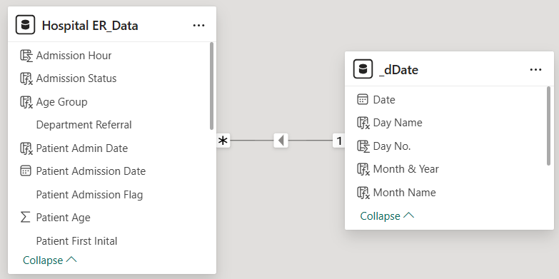

# Project Background & Overview
The hospital administration requires a high-level strategic overview of Emergency Room (ER) operations to identify long-term trends in patient volume and care quality. This project transitions from short-term "firefighting" to long-term "planning." By consolidating 18 months of data, the dashboard allows stakeholders to see if operational issues are one-time events or recurring seasonal patterns.

**Key Business Questions:**
* Can the current ER infrastructure handle an average volume of ~500 patients per month over the long term?
* Does the Patient Satisfaction Score remain stable, or is it declining as patient volume increases?
* On a macro scale, what percentage of our total patient history meets the 30-minute wait-time target?

# Data Structure Overview
The consolidated dataset is a Time-Series collection of ER visits.

* **Source:** Kaggle Public Dataset
* **Scale:** Over 9,200 unique patient records.
* **Dimensions:** Time (Calendar/Date table), Geography (Referral sources), and Demographics (Age, Gender, Race).
* **Measures:** Calculated KPIs for Average Wait Time (Time-based) and Satisfaction (Ordinal/Integer based).

**Entity Relationship Diagram (ERD):**

# Executive Summary
Between April 2023 and October 2024, the ER processed **9,216 patients**. 

Long-term data shows a perfectly even **50/50** split between Admissions and Non-admissions. However, the satisfaction score has dipped below 5.00 **(4.99)**, indicating a systemic issue with patient experience. While 61.68% of patients are seen within the target time, the sheer volume on Sundays remains the primary operational bottleneck.

**High-Level Metrics (Consolidated)**
* **Total Patients**: 9,216
* **Avg. Wait Time**: 35.3 Minutes
* **Pat. Sat. Score**: 4.99 (Lower than the April monthly average)
* **No. of Patients Referred**: 3,816
* **Within Target Rate**: 61.68%

**Consolidated View**

**Monthly View**

# Insights Deep Dive
* Sunday is consistently the busiest day of the week (**1,589 total patients**). The most dangerous "overload" periods occur between **00:00 and 04:00 on Mondays and Sundays**, where volume is consistently at its highest.
* Unlike the April-only view, the consolidated data shows that the 30-39 and 20-29 age groups are almost identical in volume (~1,200 each). This suggests the ER is a primary care source for young adults in this region.

### A Deceleration in Growth
* The province's growth rate has steadily declined over the last decade.
  * **2015 Growth**: 1.24%
  * **2020 Growth**: 1.04% (Slowest recorded in the 5-year span analysis).
* This slowing growth suggests a stabilizing population, which can relieve pressure on public resources like schools and hospitals in the long term

### Strong Labor Force Potential
* The dependency burden is relatively low.
  * **Working Age (15-64)**: 62.05%
  * **Young Dependents (<15)**: 33.14%
  * **Old Dependents (>64)**: 4.80%
* Quezon Province has a massive available workforce. The challenge is ensuring local industries (agriculture, tourism, BPO) can absorb this supply to prevent brain drain to Metro Manila.

# Recommendations
* **Job Creation in Key Hubs**: Focus economic zones in the top 10 populated LGUs (like Candelaria and Tayabas) to capitalize on the 62% working-age population.
* **Rural Development Programs**: Launch initiatives in the 30% least populated municipalities to improve density balance and reduce strain on major towns.
* **Senior Care Planning**: While the elderly population is currently low (4.8%), the slowing birth rate suggests this demographic will grow. Long-term planning for geriatric care should begin now.
